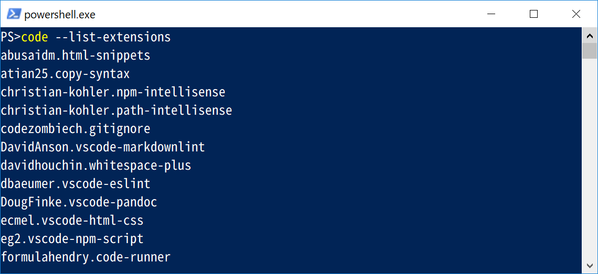

# 💎VisualStudioCodeの設定忘備録

## 💎インストールしているエクステンションの一覧エクスポート

▶下記のコマンドでインストールされているエクステンションの一覧が取得できる。  
出力される形式は`<author>.<extension>`


```Powershell
code --list-extensions
```

## 💎エクステンションのインストール

下記のコマンドからエクステンションのインストールが行える。

エクスポートしたテキストファイルを読み込んで一括インストールとかすれば便利かも？

```Powershell
code --install-extension <author>.<extension>
```

## 💎基本設定(setting.json)

VSCodeの基本設定(setting.json)は下記パスに保存されている。
定期的にバックアップとっておくほうが安心感があってよい感じ。

`C:\Users\userName\AppData\Roaming\Code\User\settings.json`

## 💎VSCodeのプラグインだけでなく別途インストール等必要なソフト

- pandocは別途アプリのインストールが必要。
- PlantUMLを利用するために別途Graphvizのインストールが必要
- ESLintは別途npmでパッケージをインストールして設定が必要
